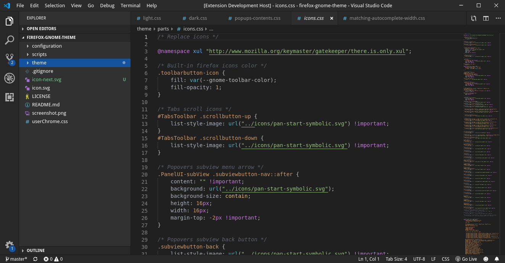

<h1 align="center">
	 
	bio (c9x/corrosion) dark VSCode GNOME theme
</h1>

<strong>Some color theme for VSCode</strong>

Colors based in One Dark for syntax and GTK Adwaita for UI.

Install it from the [VSCode Marketplace](https://marketplace.visualstudio.com/items?itemName=) or the [OpenVSX Registry](https://open-vsx.org/extension/).

## Contribute
Please see CONTRIBUTING.